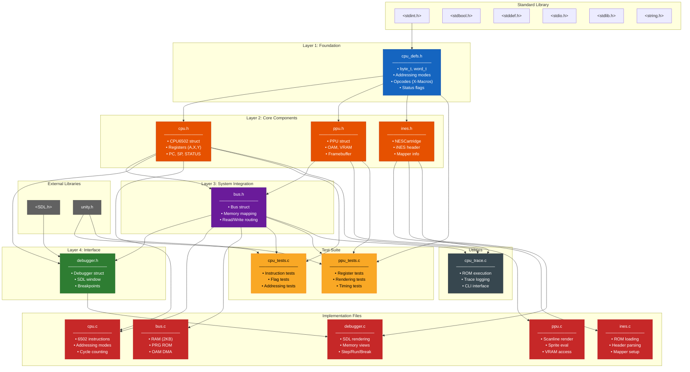

# 6502 Emulator - Architecture & Dependency Diagram

## Visual Dependency Graph (Mermaid)



## Simplified Dependency Tree (ASCII)

```
┌─────────────────────────────────────────────────────────────────────┐
│                        STANDARD LIBRARY                              │
│    <stdint.h>  <stdbool.h>  <stddef.h>  <stdio.h>  <string.h>       │
└─────────────────────────────────────────────────────────────────────┘
                                  │
                                  ▼
┌─────────────────────────────────────────────────────────────────────┐
│                     LAYER 1: FOUNDATION                              │
│                                                                      │
│  ┌─────────────────────────────────────────────────────────────┐    │
│  │                      cpu_defs.h                              │    │
│  │  • Type definitions (byte_t, word_t, offset_t)               │    │
│  │  • Addressing mode enums (13 modes)                          │    │
│  │  • Opcode definitions via X-Macros                           │    │
│  │  • CPU status flag definitions                               │    │
│  └─────────────────────────────────────────────────────────────┘    │
└─────────────────────────────────────────────────────────────────────┘
                    │              │              │
                    ▼              ▼              ▼
┌─────────────────────────────────────────────────────────────────────┐
│                    LAYER 2: CORE COMPONENTS                          │
│                                                                      │
│  ┌───────────────┐    ┌───────────────┐    ┌───────────────┐        │
│  │    cpu.h      │    │    ppu.h      │    │   ines.h      │        │
│  │───────────────│    │───────────────│    │───────────────│        │
│  │ CPU6502       │    │ PPU           │    │ NESCartridge  │        │
│  │ • A,X,Y regs  │    │ • OAM (256B)  │    │ • PRG ROM     │        │
│  │ • PC, SP      │    │ • VRAM        │    │ • CHR ROM     │        │
│  │ • STATUS      │    │ • Framebuffer │    │ • Mapper      │        │
│  │ • Cycles      │    │ • Scanline    │    │ • Mirroring   │        │
│  └───────────────┘    └───────────────┘    └───────────────┘        │
└─────────────────────────────────────────────────────────────────────┘
          │                    │                      │
          ▼                    ▼                      │
┌─────────────────────────────────────────────────────────────────────┐
│                   LAYER 3: SYSTEM INTEGRATION                        │
│                                                                      │
│  ┌─────────────────────────────────────────────────────────────┐    │
│  │                         bus.h                                │    │
│  │  • System bus connecting CPU ↔ Memory ↔ PPU                  │    │
│  │  • Memory map: $0000-$07FF (RAM), $2000-$2007 (PPU regs)    │    │
│  │  • PRG ROM: $8000-$FFFF                                      │    │
│  │  • OAM DMA transfers                                         │    │
│  └─────────────────────────────────────────────────────────────┘    │
└─────────────────────────────────────────────────────────────────────┘
          │                                           │
          ▼                                           ▼
┌─────────────────────────────────────────────────────────────────────┐
│                    LAYER 4: INTERFACE / TOOLS                        │
│                                                                      │
│  ┌─────────────────────────┐         ┌─────────────────────────┐    │
│  │     debugger.h          │         │     cpu_trace.c         │    │
│  │─────────────────────────│         │─────────────────────────│    │
│  │ • SDL2 window/renderer  │         │ • CLI trace utility     │    │
│  │ • Breakpoint system     │         │ • ROM execution         │    │
│  │ • Memory viewer         │         │ • Instruction logging   │    │
│  │ • CPU/PPU state display │         └─────────────────────────┘    │
│  │ • Pattern table viewer  │                                        │
│  └─────────────────────────┘                                        │
└─────────────────────────────────────────────────────────────────────┘

┌─────────────────────────────────────────────────────────────────────┐
│                        IMPLEMENTATION FILES                          │
│                                                                      │
│  cpu.c ──────► Implements 6502 instruction set (256 opcodes)        │
│                All addressing modes, cycle-accurate timing           │
│                                                                      │
│  ppu.c ──────► PPU rendering pipeline, scanline-based               │
│                Background/sprite rendering, VRAM management          │
│                                                                      │
│  bus.c ──────► Memory routing, address decoding                     │
│                RAM mirroring, PRG ROM banking                        │
│                                                                      │
│  ines.c ─────► iNES/NES 2.0 ROM file parser                         │
│                Mapper detection, ROM data extraction                 │
│                                                                      │
│  debugger.c ─► SDL2 GUI, rendering, input handling                  │
│                Disassembly, memory inspection, breakpoints           │
└─────────────────────────────────────────────────────────────────────┘

┌─────────────────────────────────────────────────────────────────────┐
│                          TEST SUITE                                  │
│                                                                      │
│  cpu_tests.c ► Unity framework tests for all CPU instructions       │
│                Addressing mode verification, flag behavior           │
│                                                                      │
│  ppu_tests.c ► Unity framework tests for PPU functionality          │
│                Register tests, timing verification                   │
└─────────────────────────────────────────────────────────────────────┘
```

## Include Dependency Matrix

| File          | cpu_defs.h | cpu.h | ppu.h | bus.h | ines.h | debugger.h | SDL.h | unity.h |
|---------------|:----------:|:-----:|:-----:|:-----:|:------:|:----------:|:-----:|:-------:|
| cpu_defs.h    | -          |       |       |       |        |            |       |         |
| cpu.h         | ✓          | -     |       |       |        |            |       |         |
| ppu.h         | ✓          |       | -     |       |        |            |       |         |
| ines.h        | ✓          |       |       |       | -      |            |       |         |
| bus.h         | ✓          | ✓     | ✓     | -     |        |            |       |         |
| debugger.h    |            | ✓     |       | ✓     |        | -          | ✓     |         |
| cpu.c         |            | ✓     |       | ✓     |        |            |       |         |
| ppu.c         |            |       | ✓     |       |        |            |       |         |
| bus.c         |            |       |       | ✓     |        |            |       |         |
| ines.c        |            |       |       |       | ✓      |            |       |         |
| debugger.c    |            |       |       |       | ✓      | ✓          |       |         |
| cpu_tests.c   |            | ✓     |       | ✓     |        |            |       | ✓       |
| ppu_tests.c   | ✓          |       | ✓     | ✓     |        |            |       | ✓       |
| cpu_trace.c   |            | ✓     |       | ✓     | ✓      |            |       |         |

## Data Flow Diagram

```
┌──────────────────────────────────────────────────────────────────────────┐
│                              NES SYSTEM                                   │
│                                                                          │
│   ┌─────────┐                                         ┌─────────┐        │
│   │  ROM    │                                         │ Display │        │
│   │ (.nes)  │                                         │ Output  │        │
│   └────┬────┘                                         └────▲────┘        │
│        │                                                   │             │
│        ▼                                                   │             │
│   ┌─────────┐         ┌─────────────────────┐         ┌────┴────┐        │
│   │  ines   │────────►│        BUS          │────────►│   PPU   │        │
│   │ loader  │         │                     │◄────────│         │        │
│   └─────────┘         │  ┌───────────────┐  │         │ • VRAM  │        │
│                       │  │   RAM (2KB)   │  │         │ • OAM   │        │
│                       │  │ $0000-$07FF   │  │         │ • Tiles │        │
│                       │  └───────────────┘  │         └─────────┘        │
│                       │                     │              ▲             │
│                       │  ┌───────────────┐  │              │             │
│   ┌─────────┐         │  │  PRG ROM      │  │         NMI/IRQ            │
│   │   CPU   │◄───────►│  │ $8000-$FFFF   │  │              │             │
│   │  6502   │         │  └───────────────┘  │              │             │
│   │         │         │                     │              │             │
│   │ • A,X,Y │         │  ┌───────────────┐  │              │             │
│   │ • PC,SP │         │  │  PPU Regs     │  │──────────────┘             │
│   │ • FLAGS │         │  │ $2000-$2007   │  │                            │
│   └─────────┘         └─────────────────────┘                            │
│        ▲                                                                 │
│        │                                                                 │
│   ┌────┴────┐                                                            │
│   │Debugger │  (SDL2 interface for development/testing)                  │
│   └─────────┘                                                            │
└──────────────────────────────────────────────────────────────────────────┘
```

## Build Dependency Order

For compilation, files should be built in this order:

1. **cpu_defs.h** - No dependencies (header only)
2. **cpu.h** - Depends on cpu_defs.h
3. **ppu.h** - Depends on cpu_defs.h
4. **ines.h** - Depends on cpu_defs.h
5. **bus.h** - Depends on cpu.h, ppu.h
6. **debugger.h** - Depends on cpu.h, bus.h, SDL.h
7. **ines.c → ines.o**
8. **ppu.c → ppu.o**
9. **cpu.c → cpu.o**
10. **bus.c → bus.o**
11. **debugger.c → debugger.o** (requires SDL2)
12. **Link all objects** → final executable
